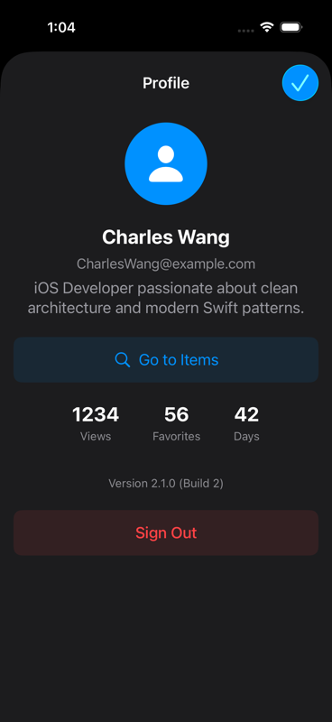
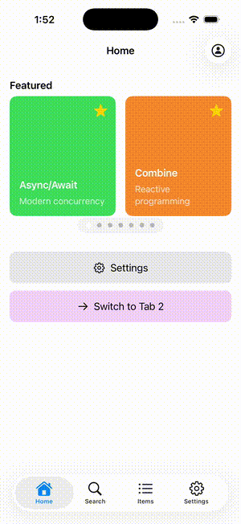

# Fun - iOS Demo App

[](https://github.com/g-enius/Fun-iOS/actions/workflows/ci.yml)

A modern iOS application demonstrating clean architecture (MVVM-C), Swift Concurrency, modular design with Swift Package Manager, and best practices for scalable iOS development. Android counterpart: [Fun-Android](https://github.com/g-enius/Fun-Android).

## Screenshots

| Home | Detail | Profile | Settings |
|------|--------|---------|----------|
|  |  |  |  |

## Demo



## Tech Stack

| Category | Technology |
|----------|------------|
| Language | Swift 6.0 |
| UI Framework | SwiftUI + UIKit |
| Reactive & Concurrency | Combine, Swift Concurrency (async/await) |
| Architecture | MVVM + Coordinator |
| Dependency Injection | Session-Scoped DI + Property Wrapper |
| Package Management | Swift Package Manager |
| Minimum iOS | iOS 15.0 |
| On-Device LLM | Apple Intelligence / Foundation Models (iOS 26+) |
| Testing | Swift Testing, swift-snapshot-testing |

## Module Structure

```
Fun-iOS/
├── FunApp/         # iOS app target (Xcode project)
├── Coordinator/    # Navigation coordinators
├── UI/             # SwiftUI views & UIKit controllers
├── ViewModel/      # Business logic (MVVM)
├── Model/          # Data models & protocols
├── Services/       # Concrete service implementations
└── Core/           # Utilities, DI container, L10n
```

All modules except `FunApp` are Swift packages. `FunApp` is the Xcode project that consumes them.

**Dependency Hierarchy:**
```
FunApp → Coordinator → UI → ViewModel → Model → Core
  └────→ Services ─────────────────────→┘
```

## Key Patterns

### MVVM + Coordinator
- **ViewModel**: Business logic, state management
- **View**: Pure UI (SwiftUI)
- **Coordinator**: Navigation flow, screen transitions

### Session-Scoped Dependency Injection

Each app flow gets its own **session** with a dedicated set of services. When the flow changes, the old session tears down and a fresh one activates — no stale state leaks between login and main.

```
LoginSession:         logger, network, featureToggles
AuthenticatedSession: logger, network, featureToggles, favorites, toast, ai
```

```swift
// Sessions activate/teardown automatically on flow transitions
protocol Session: AnyObject {
    func activate()   // register services
    func teardown()   // reset ServiceLocator
}

// ViewModels resolve lazily — no changes needed
@Service(.network) var networkService: NetworkService
```

### Protocol-Oriented Design
All services defined as protocols in `Model`, implementations in `Services`.

### Coordinator Hierarchy

```
AppCoordinator
├── LoginCoordinator
├── HomeCoordinator
│   ├── DetailCoordinator
│   └── ProfileCoordinator (modal)
├── ItemsCoordinator
│   └── DetailCoordinator
└── SettingsCoordinator
```

`AppCoordinator` manages login/main flow transitions with session lifecycle.

### Deep Linking

URL scheme `funapp://` for navigation:
- `funapp://tab/items` - Switch to Items tab
- `funapp://item/swiftui` - Open item detail
- `funapp://profile` - Open profile

Test from terminal:
```bash
xcrun simctl openurl booted "funapp://tab/items"
xcrun simctl openurl booted "funapp://item/swiftui"
xcrun simctl openurl booted "funapp://profile"
```

Deep links received during login are queued and executed after authentication.

## Features

- **Session-Scoped DI**: Clean service lifecycle per app flow — no stale state
- **Reactive Data Flow**: Combine framework with `@Published` properties
- **Feature Toggles**: Runtime flags persisted via services
- **AI Summary**: On-device LLM summarisation using Apple Intelligence / Foundation Models (iOS 26+)
- **Error Handling**: Centralized `AppError` enum with toast notifications
- **Modern Search**: Debounced input, loading states
- **Pull-to-Refresh**: Native SwiftUI `.refreshable`
- **Dark Mode & Dynamic Type**: System-adaptive colors, semantic font styles, System/Light/Dark appearance picker
- **iOS 17+ APIs**: Symbol effects, sensory feedback (backwards compatible)

## UIKit + SwiftUI Hybrid

**UIKit for navigation** (reliable Coordinator pattern), **SwiftUI for content**.

| Use Case | Framework |
|----------|-----------|
| Navigation/Presentation | UIKit (`UINavigationController` + Coordinators) |
| Content & Layout | SwiftUI (all views) |
| Forms & Settings | SwiftUI |

## SwiftUI Navigation Branch

A parallel branch explores replacing the UIKit navigation layer with **pure SwiftUI navigation** (`NavigationStack` + `NavigationPath`), while keeping everything else identical. See [PR #1](https://github.com/g-enius/Fun-iOS/pull/1) for the full diff.

### Approach

| Aspect | `main` (UIKit Navigation) | `feature/swiftui-navigation` (Pure SwiftUI) |
|--------|--------------------------|---------------------------------------------|
| App entry point | `AppDelegate` + `SceneDelegate` | SwiftUI `@main App` |
| Tab bar | `UITabBarController` subclass | SwiftUI `TabView` |
| Navigation stack | `UINavigationController` | `NavigationStack` + `NavigationPath` |
| Push navigation | `pushViewController(_:animated:)` | `path.append(item)` |
| Modal presentation | `present(_:animated:)` + `UIAdaptivePresentationControllerDelegate` | `.sheet(isPresented:)` |
| Back detection | `didMove(toParent:)` override | Automatic (path shrinks on pop) |
| Coordinator protocol | Per-screen protocol in `Model` + impl in `Coordinator` | Eliminated — closures on ViewModel |
| ViewModel → Coordinator | `weak var coordinator: HomeCoordinator?` | `var onShowDetail: ((FeaturedItem) -> Void)?` |
| Share sheet | `UIActivityViewController` via coordinator | SwiftUI `ShareLink` |
| Toast overlay | Child `UIHostingController` with Auto Layout | `.overlay(alignment: .top)` |
| Dark mode | `window?.overrideUserInterfaceStyle` in SceneDelegate | `.preferredColorScheme()` on root view |
| Deep links | `scene(_:openURLContexts:)` | `.onOpenURL { }` |
| Minimum iOS | 15.0 | 16.0 (requires `NavigationStack`) |

### What Changed

| Metric | Value |
|--------|-------|
| Files added | 3 (`FunApp.swift`, `AppRootView.swift`, `MainTabView.swift`) |
| Files deleted | 30 (coordinators, protocols, mocks, UIViewControllers) |
| Files modified | 36 |
| Lines added | 637 |
| Lines removed | 1,789 |
| **Net reduction** | **-1,152 lines** |

### What Was Eliminated

- 6 coordinator protocol definitions + 6 coordinator implementations
- 5 mock coordinators (test doubles)
- 7 `UIViewController` subclasses (thin wrappers hosting SwiftUI views)
- `BaseCoordinator` abstract class
- `HomeTabBarController` (144 lines) + `HomeTabBarViewModel` (53 lines) + tests
- `UIViewController+SwiftUI` hosting extension
- `AppDelegate` + `SceneDelegate`

### Trade-offs

| | UIKit Navigation (main) | SwiftUI Navigation (branch) |
|-|------------------------|----------------------------|
| Maturity | Battle-tested, predictable | Newer, occasional edge cases |
| Type safety | Runtime (push any VC) | Compile-time (`Hashable` destinations) |
| Coordinator pattern | Full protocol-based hierarchy | Simplified to closure wiring |
| Code volume | More boilerplate (protocols, impls, mocks) | ~1,150 fewer lines |
| iOS support | iOS 15+ | iOS 16+ |
| Transition control | Full (`UINavigationControllerDelegate`) | Limited (no custom transition API) |
| Testing | Mock coordinators for navigation assertions | Test closures directly |

Both approaches produce **visually identical** apps — same screens, same behavior, same features.

## Testing

- **Unit Tests**: ViewModels, services, and session lifecycle
- **Session DI Tests**: Activation, teardown, transitions, state isolation
- **Snapshot Tests**: Visual regression testing for all views
- **Parameterized Tests**: Swift Testing with custom scenarios

## Getting Started

### Requirements
- Xcode 16.0+
- iOS 15.0+
- Swift 6.0

### Installation
```bash
git clone https://github.com/g-enius/Fun-iOS.git
cd Fun-iOS
open Fun.xcworkspace
```

### Running
1. Open `Fun.xcworkspace`
2. Select `FunApp` scheme
3. Choose simulator (iPhone 17 Pro recommended)
4. `Cmd + R` to build and run

### Tests
```bash
xcodebuild test -workspace Fun.xcworkspace -scheme FunApp \
  -destination 'platform=iOS Simulator,name=iPhone 17 Pro'
```

## Code Quality

- SwiftLint with strict rules (no force unwraps)
- GitHub Actions CI (lint, build, test)
- OSLog structured logging
- SwiftGen for type-safe localization

## AI-Assisted Development

This project demonstrates **AI-assisted iOS development** using [Claude Code](https://claude.ai/code) with project-level configuration for team-shareable guardrails, branch-aware rules, and custom workflows.


Architecture and patterns designed by developer. Claude Code assists with feature implementation, bug fixes, testing, cross-platform parity checks, and code review — guided by project-level rules that enforce the architecture.

Commits with AI assistance include `Co-Authored-By: Claude` attribution.

### Claude Code Project Configuration

```
.claude/
├── settings.json                  # Team-shared permissions (auto-approve build/test/lint)
├── skills/
│   ├── review/SKILL.md            # /review — architecture + similar-pattern search
│   ├── fix-issue/SKILL.md         # /fix-issue — end-to-end GitHub issue workflow
│   ├── cross-platform/SKILL.md    # /cross-platform — iOS vs Android parity check
│   └── pull-request/SKILL.md      # /pull-request — draft PR with tests + accessibility
└── agents/
    └── change-reviewer.md         # Branch-aware code review agent
CLAUDE.md                          # Architecture rules, anti-patterns, build commands
ai-rules/
├── general.md                     # MVVM-C patterns, DI, sessions, testing reference
├── swift-style.md                 # Swift 6 concurrency, naming, reactive patterns
└── ci-cd.md                       # GitHub Actions CI workflow patterns
```

**Branch-aware**: Each branch has its own `CLAUDE.md` and `ai-rules/` adapted for that branch's architecture. The change-reviewer agent knows which patterns to enforce — e.g., flagging `import Combine` on the `async-sequence` branch, or `import UIKit` on the SwiftUI branches.

**Multi-branch workflow**: Shared changes commit to `main` first, then feature branches rebase — enforced via project-level rules.

**Cross-platform**: The `/cross-platform` skill compares iOS and Android implementations to catch unintentional UI/behavior divergences.

---

MIT License
